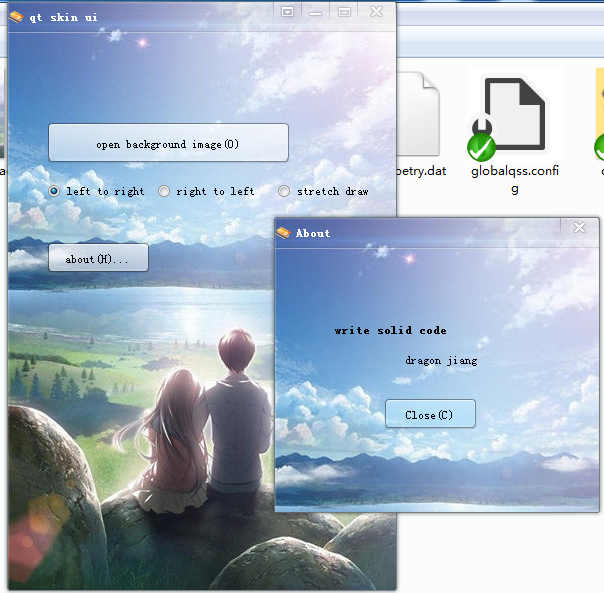
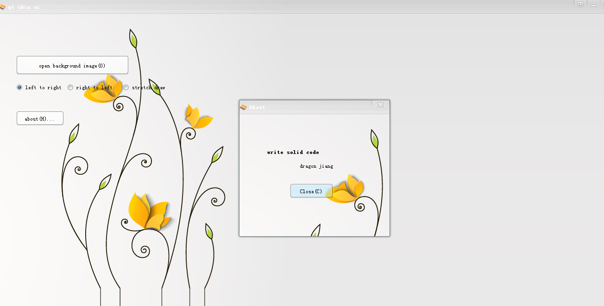
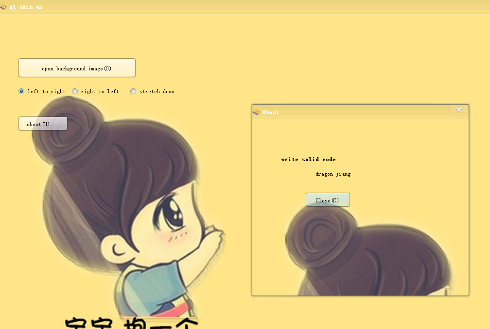
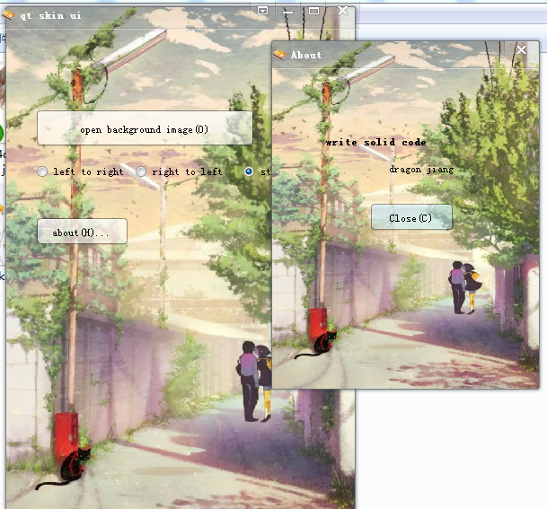

一个Qt + VS2013编写的GUI框架。用一张图片做背景，可轻松实现换皮肤功能

亮点：


###1. res目录下有N多种控件的图片, 应用output目录下的globalqss.config 即可将默认的控件都变成很漂亮
```cpp
    QApplication a(argc, argv);
    a.setStyleSheet(load_txt_file(app_path() + QStringLiteral("globalqss.config")));
```

###2. UI界面都从Base_Widget继承，例如：
```cpp
//这是主界面, 从QWidget继承
class Main_Form : public Base_Widget<QWidget> {
    ...
};

//这是对话框, 从QDialog继承
class About_Form : public Base_Widget<QDialog> {
    ...
};
```

###3. 所有UI的设计都用Qt Designer完成，然后再加载进对话框。示例代码：
```cpp
namespace Ui {
    class UI_About;  //这个类Qt Designer设计好.ui文件后自动生成
};

class About_Form : public Base_Widget<QDialog> {
public:
    About_Form::About_Form(QWidget *parent /*= 0*/, Skin *skin /*= NULL*/)
        :BaseClass(parent, skin)
    {
        ui_ = new Ui::UI_About();
        this->setup_UI(ui_);    //这一行代码将Qt Designer设计好的界面加载，然后对话框就变得挺漂亮了
    }

private:
    Ui::UI_About *ui_;
};

```

###4. 效果示例：
请打开output目录下的 qtskinui.exe, 然后换几个图片。


怎么样？效果满意吧？来看看效果图:


 
 
 
 

